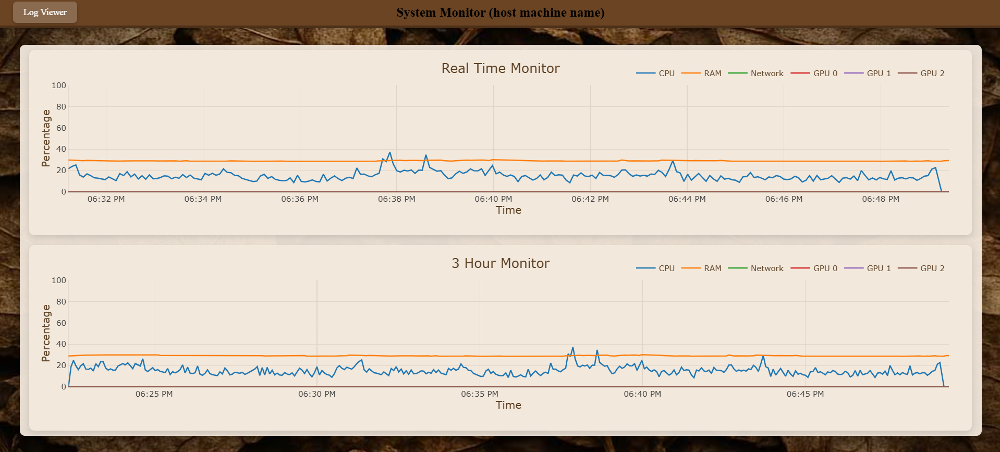
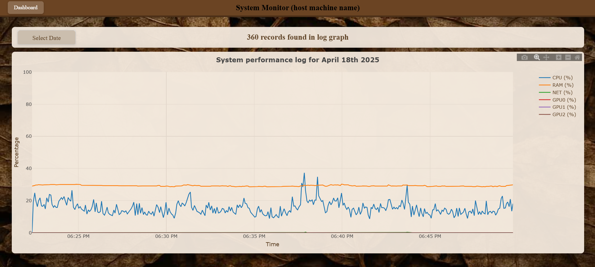

# SysMonitor

A comprehensive system monitoring web application that tracks and visualizes CPU, RAM, network, and GPU usage in real-time.

## Overview

SysMonitor provides a browser-based interface for monitoring system resources. The application collects performance metrics from your machine (CPU, RAM, GPU 0, GPU 1, GPU 2 and Network) and presents them in an intuitive dashboard with real-time updates and historical data visualization utilizing Plotly graphs.

## Features

- **Real-time Monitoring**: Visualize CPU, RAM, network, and up to 3 GPUs usage in real-time
- **Historical Data**: View performance trends with 3-hour historical graphs
- **Log Management**: Automatic log rotation with archiving of older data
- **Always Running Service**: Linux users can make use of the sysmonitor.service file to have the web app start on boot up of host machine.

## Requirements

- Python 3.6 or higher
- Modern web browser
- Linux, macOS, or Windows operating system
- Dependencies:
  - Flask
  - Dash
  - Plotly
  - psutil
  - GPUtil
  - pandas

## Installation & Deployment

### Option 1: Quick Setup with Deployment Scripts

1. Clone the repository:
   ```bash
   git clone https://github.com/mixbits/SysMonitor.git
   cd SysMonitor
   ```

2. Run the deployment script for your platform:
   
   **For Linux/macOS:**
   ```bash
   ./install.sh
   ```
   
   **For Windows:**
   ```bash
   python deploy.py
   ```

3. Start the application:
   
   **For Linux/macOS:**
   ```bash
   ./start.sh
   ```
   
   **For Windows:**
   ```bash
   start.bat
   ```

### Option 2: Manual Setup

1. Create a Python virtual environment:
   ```bash
   python3 -m venv venv
   ```

2. Activate the environment:
   
   **For Linux/macOS:**
   ```bash
   source venv/bin/activate
   ```
   
   **For Windows:**
   ```bash
   venv\Scripts\activate
   ```

3. Install dependencies:
   ```bash
   pip install -r requirements.txt
   ```

4. Start the application:
   ```bash
   python sysmonitor.py
   ```

### Option 3: Run as a System Service (Linux only)

1. Edit the `sysmonitor.service` file:
   ```bash
   sudo nano /etc/systemd/system/sysmonitor.service
   ```

2. Replace all instances of 'user' with your actual username in the file.

3. Enable and start the service:
   ```bash
   sudo systemctl enable sysmonitor.service
   sudo systemctl start sysmonitor.service
   ```

## Configuration

Before running the application, you need to make a few configuration changes:

1. **Replace Username**: In `sysmonitor.py` and `sysmonitor.service`, replace all instances of 'user' with your actual system username.

2. **Set Hostname**: In `dashboard.html` and `logviewer.html`, replace "(host machine name)" with your actual hostname:
   
   For example, change:
   ```html
   System Monitor (host machine name)
   ```
   to:
   ```html
   System Monitor (myserver)
   ```

3. **Port Configuration**: By default, the application runs on port 5500. If you need to change this, modify the port in `sysmonitor.py`.

## Accessing the Dashboard

Once the application is running, access the dashboard by opening a web browser and navigating to:

```
http://localhost:5500
```

Or if accessing from another device on your network:

```
http://your-server-ip:5500
```

## Log Files

Logs are stored in:
- `/home/your-username/Documents/SystemMonitor/logs/` (Linux/macOS)
- Or the equivalent directory on Windows

## Important Notes
- Make sure port 5500 is open in your firewall
- Linux web application directory: /home/user/Documents/SystemMonitor/ <!--Replace user with your username-->

## Troubleshooting

If the application fails to start:

1. Check that all dependencies are installed
2. Verify that the username has been replaced in all configuration files
3. Ensure the application has permission to read system statistics
4. Check the log file at `/home/your-username/Documents/SystemMonitor/logs/sysmonitor.log`

## License
This project is licensed under the MIT License.​
It utilizes Plotly, which is also licensed under the MIT License.​
For more details, please refer to the LICENSE.txt file.

## Screenshots



